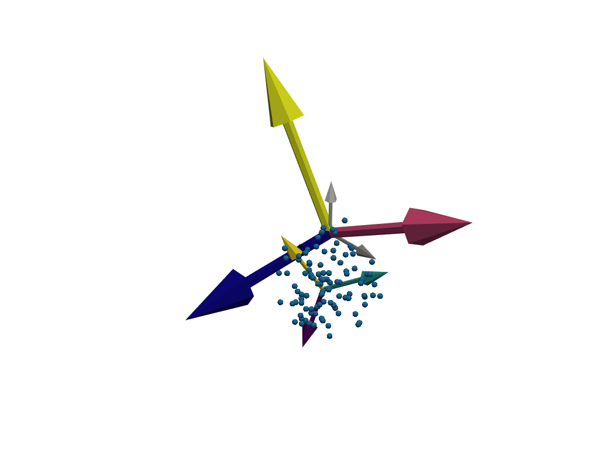

# Coordsys : a 3D coordinate system library

A Python package for quaternion-based coordinate frame operations. Supports Quantities package.

## Installation

```bash
pip install -e .
```

## Usage


```python
from coordsys import CoordinateSystem
import quantities as pq
import numpy as np
import matplotlib.pyplot as plt
import pyvista as pv
```


```python
plotter = pv.Plotter()

# Create a random point cloud
N = 100
points = np.random.rand(N, 3)

# Create a reference coordinate system
Reference = CoordinateSystem()

# Create a main coordinate system
Main = CoordinateSystem()

# Create a child coordinate system
Child = Main.add_child(label='Child') # Add a child coordinate system to the main one
Child.add_points(points)
Child.translate([2, 2, 0]*pq.m)
Child.rotate_euler_local([0, 1, 1], 30*pq.deg)

Main.scale(3, inherit=False) # Scale the main coordinate system, but not its children
Main.rotate_euler_local([1, 0, 0], 30*pq.deg, inherit=True)

Reference.visualize(plotter=plotter, inherit=False, cmap='gray')
Main.visualize(plotter=plotter, inherit=False, cmap='plasma')
Child.visualize(plotter=plotter, inherit=False, cmap='viridis')

plotter.save_graphic('assets/coordsys.svg')
```




